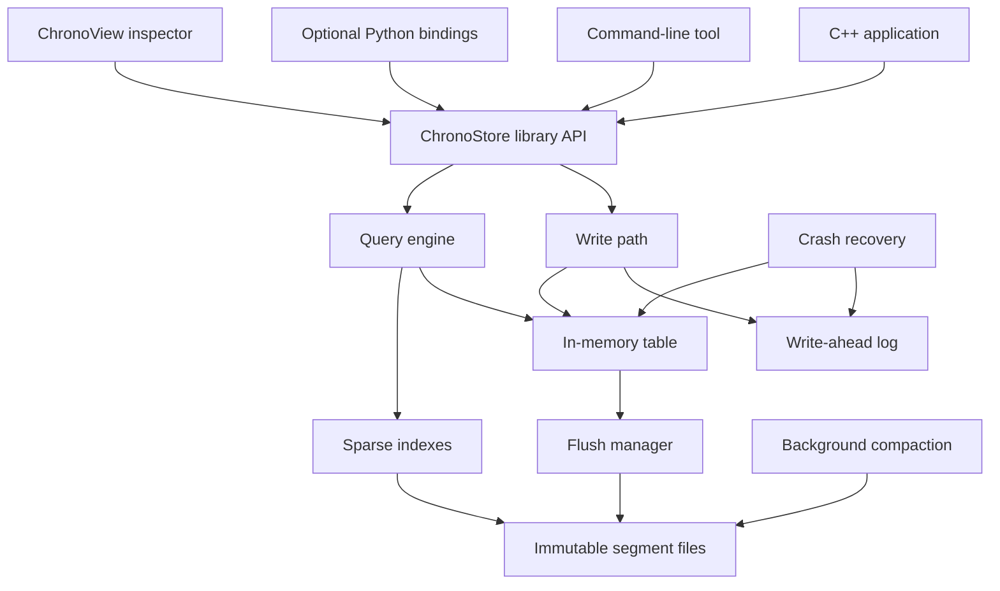

# ChronoStore

ChronoStore is a C++20 embedded time-series storage engine designed for
high-volume telemetry, observability, sensor data, simulation output, and
market-data-style workloads. The project focuses on storage-engine internals:
durability, binary file formats, indexing, compression, concurrency, crash
recovery, and measurable performance.

> **Project status:** Milestone 2 is complete and Milestone 3 is in progress.
> The data model and ordered in-memory table are joined by portable binary
> codecs, CRC32C checksums, and a versioned WAL record encoder. WAL file I/O,
> synchronization, decoding, and crash recovery are not implemented yet.

## Implemented

- C++20 static-library target with strict Clang, GCC, and MSVC warnings.
- Validated `Tag`, canonical `SeriesKey`, strong `Timestamp`, and finite `Sample`
  value types.
- Deterministic tag ordering and duplicate tag-key rejection.
- Internal ordered MemTable with last-write-wins updates, latest-value lookup,
  and half-open `[start, end)` range queries.
- Explicit little-endian byte encoding with bounds-checked reads.
- Portable CRC32C corruption detection with standard known-answer coverage.
- Versioned, length-delimited, checksummed WAL `PUT` record encoding.
- GoogleTest integration with 38 discovered model, MemTable, and codec tests.
- Project-wide `clang-format` configuration.

## Project Goals

- Provide a small embeddable C++ library for timestamped numeric data.
- Preserve acknowledged writes across process crashes using a write-ahead log.
- Serve efficient point and time-range queries through sparse indexes.
- Keep query memory bounded by streaming results from immutable segments.
- Compact segment files safely in the background.
- Expose correctness and performance through tests, benchmarks, and metrics.
- Support a CLI, optional Python bindings, and a native inspection GUI.

ChronoStore is intentionally single-node and specialized. It is not intended
to implement SQL, relational joins, distributed consensus, or cloud service
management.

## Data Model

A series is identified by a measurement name and a canonical set of tags. Each
series contains timestamped numeric samples.

```text
measurement: cpu_usage
tags:        host=server-01, region=mumbai
timestamp:   1783308123456789000 nanoseconds since Unix epoch
value:       72.4
```

The same model can represent application metrics, IoT readings, robotics
telemetry, scientific measurements, energy usage, network statistics, or
financial time series.

## Planned Architecture



See [docs/architecture.md](docs/architecture.md) for the design boundaries,
planned guarantees, component responsibilities, and implementation sequence.

## Planned Interfaces

- **C++ library:** direct, low-overhead embedding in another application.
- **CLI:** import, query, inspect, verify, benchmark, and compact databases.
- **Python bindings:** analytics and notebook workflows through `pybind11`.
- **ChronoView:** native engineering GUI for charts and storage inspection.
- **HTTP service:** optional language-neutral integration layer.

The C++ library and CLI are core deliverables. Other interfaces will be added
only after storage correctness and recovery are well tested.

## Repository Layout

```text
include/chronostore/      Public C++ headers
src/                      Storage-engine implementation
tests/                    Unit and integration tests
tools/chronostore_cli/    Command-line application
docs/                     Architecture and design documentation
```

The library currently implements the public data model, ordered in-memory
queries, and the encoding foundation for persistent records. The CLI remains
a placeholder until the storage engine exposes durable operations.

## Development Roadmap

1. **Complete:** Establish the CMake build, public data model, and model tests.
2. **Complete:** Implement an ordered in-memory table and range-query semantics.
3. **In progress:** Complete WAL decoding, durable append, and deterministic
   crash recovery on top of the checksummed record format.
4. Write immutable on-disk segments with versioned binary formats.
5. Add sparse indexes and streaming multi-segment queries.
6. Introduce background flushing and a documented concurrency model.
7. Implement atomic manifests and segment compaction.
8. Add timestamp/value compression and a bounded block cache.
9. Build administration tools, Python bindings, and ChronoView.
10. Publish reproducible benchmarks and failure-injection results.

Each milestone must include focused tests and documented invariants before the
next storage layer is introduced.

## Intended Toolchain

- C++20 compiler: Clang, GCC, or MSVC
- CMake and Ninja
- GoogleTest 1.17.0, pinned through CMake `FetchContent`
- Google Benchmark, planned for the performance milestone
- clang-format
- Clang sanitizers and static analysis
- Dear ImGui and ImPlot for the later ChronoView application

Additional dependencies will be pinned when their corresponding components are
introduced. The first test-enabled CMake configuration downloads GoogleTest.

## Building

Configure, build, and run the tests with:

```bash
cmake -S . -B build -G Ninja
cmake --build build
ctest --test-dir build --output-on-failure
```

Disable test dependencies for a library-only build with:

```bash
cmake -S . -B build -G Ninja -DBUILD_TESTING=OFF
cmake --build build
```

Check formatting with:

```bash
clang-format --dry-run --Werror \
  include/chronostore/model.hpp \
  src/model.cpp \
  tests/model_test.cpp
```

## Correctness and Performance

Performance claims will be accompanied by workload definitions, machine and
compiler details, data sizes, and latency distributions. Durability claims
will be covered by recovery, partial-write, corruption, and failure-injection
tests. No benchmark or reliability claim is considered complete without a
reproducible test.

## License

No open-source license has been selected yet.
