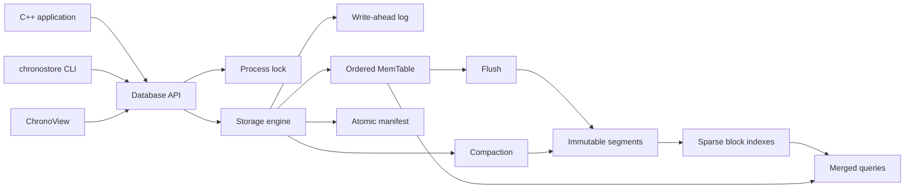

# ChronoStore

ChronoStore is a C++20 embedded time-series storage engine. It is designed to
show storage-systems and production C++ depth through durable writes, explicit
binary formats, sparse on-disk indexes, crash recovery, synchronization,
compaction, packaging, benchmarks, a CLI, and a native inspection GUI.

**Status:** the v0.1 storage core is functional. The library, CLI, ChronoView,
examples, benchmark driver, CMake package, and 112 automated tests are
implemented. The current file format is versioned but remains pre-1.0 and may
change between releases.


## What It Demonstrates

- Modern C++20 value types, RAII, PImpl, move-only ownership, and standard
  library concurrency.
- A write-ahead log with configurable durability and deterministic recovery.
- Bounds-checked little-endian codecs and CRC32C integrity checks.
- Immutable segment files split into blocks of at most 256 samples.
- A checksummed sparse index that lets readers fetch only relevant blocks.
- Atomic manifest replacement and crash-safe WAL rotation.
- Last-write-wins merge semantics across memory, WAL recovery, and segments.
- Synchronous compaction that rewrites live state before atomically publishing
  it.
- Multi-threaded readers and writers with one exclusive process owner.
- A dependency-light public C++ API, command-line client, native GUI, package
  installation, sanitizer build, and external-consumer test.

ChronoStore is useful for telemetry, observability metrics, IoT readings,
robotics and simulation output, energy data, scientific measurements, and
market-data-style time series. It is not tied to stocks or finance.

## Architecture



The successful write order is WAL append, optional durable synchronization,
then MemTable mutation. A flush writes and synchronizes a new segment, opens it
for validation, publishes a new manifest atomically, and only then resets the
WAL. Recovery tolerates an incomplete final WAL record, rejects complete
corruption, and de-duplicates the crash window where a manifest was published
before the WAL was reset.

See [Architecture](docs/architecture.md) and
[File Formats](docs/file-formats.md) for the detailed invariants.

## Data Model

A series is a measurement plus a canonical set of string tags. A sample is a
signed 64-bit Unix timestamp in nanoseconds and a finite IEEE 754 `double`.

```text
measurement: temperature
tags:        room=lab, sensor=primary
timestamp:   1700000000000000000
value:       21.5
```

Tags are sorted by key, duplicate tag keys are rejected, and input tag order
does not change series identity. Rewriting the same `(series, timestamp)` uses
last-write-wins semantics without increasing the logical sample count. Ranges
are ordered and half-open: `[start, end)`.

## Prerequisites

- CMake 3.24 or newer.
- A C++20 compiler: recent Clang, AppleClang, GCC, or MSVC.
- Ninja is recommended; another CMake generator also works.
- Git and network access on the first test or GUI configuration so CMake can
  fetch pinned dependencies.
- OpenGL and platform window-development libraries when building ChronoView.

GoogleTest is fetched only when `BUILD_TESTING=ON`. Dear ImGui 1.92.8, ImPlot
1.0, and GLFW 3.4 are fetched only when `CHRONOSTORE_BUILD_GUI=ON`.

## Build And Test

```bash
cmake -S . -B build -G Ninja -DCMAKE_BUILD_TYPE=Debug
cmake --build build --parallel
ctest --test-dir build --output-on-failure
```

For a library-only build with no downloaded test dependencies:

```bash
cmake -S . -B build-lib -G Ninja \
  -DBUILD_TESTING=OFF \
  -DCHRONOSTORE_BUILD_TOOLS=OFF \
  -DCHRONOSTORE_BUILD_EXAMPLES=OFF \
  -DCHRONOSTORE_BUILD_BENCHMARKS=OFF
cmake --build build-lib --parallel
```

Enable AddressSanitizer and UndefinedBehaviorSanitizer on Clang or GCC with
`-DCHRONOSTORE_ENABLE_SANITIZERS=ON`.

## ChronoView GUI

ChronoView is a native C++ client built on the same public API as every other
consumer. It discovers series, writes samples, runs point/latest/range
queries, plots results, displays exact timestamps in a table, reports engine
statistics, and exposes sync, flush, and compaction commands.

```bash
cmake -S . -B build-gui -G Ninja \
  -DCHRONOSTORE_BUILD_GUI=ON \
  -DBUILD_TESTING=OFF
cmake --build build-gui --parallel
./build-gui/chronoview ./demo-db --demo
```

`--demo` writes and plots a deterministic 240-sample temperature series. Run
without it to inspect an existing database directory. See
[ChronoView](docs/chronoview.md) for controls and build notes.

## CLI

The `chronostore` executable uses tab-separated output suitable for shell
pipelines. A missing point or latest value returns exit status `2`.

```bash
./build/chronostore put ./example-db temperature 100 21.5 room=lab
./build/chronostore put ./example-db temperature 200 22.75 room=lab
./build/chronostore get ./example-db temperature 100 room=lab
./build/chronostore latest ./example-db temperature room=lab
./build/chronostore range ./example-db temperature 0 1000 room=lab
./build/chronostore series ./example-db
./build/chronostore stats ./example-db
./build/chronostore flush ./example-db
./build/chronostore compact ./example-db
```

Only one process may own a database directory at a time, so close ChronoView
before opening the same directory through the CLI.

## C++ API

```cpp
#include <chronostore/database.hpp>

chronostore::Database database{"telemetry-db"};
chronostore::SeriesKey series{
    "temperature", {chronostore::Tag{"room", "lab"}}};

database.put(
    series,
    chronostore::Sample{chronostore::Timestamp{1700000000000000000LL}, 21.5});

const auto sample = database.latest(series);
const auto window = database.range(
    series,
    chronostore::Timestamp{1699999999000000000LL},
    chronostore::Timestamp{1700000001000000000LL});

database.flush();
database.compact();
```

`DatabaseCorruptionError` reports malformed WAL, manifest, or segment state;
`DatabaseBusyError` reports an existing process owner. Invalid model values
use standard argument exceptions, while operating-system failures use
`std::system_error`.

## Durability And Concurrency

- `Durability::sync_on_write` is the default. Each successful `put` performs
  an `fsync`-equivalent operation before the sample becomes visible in memory.
- `Durability::buffered` improves throughput but requires `sync()` or `flush()`
  before the application can claim durable persistence.
- `memtable_flush_threshold` defaults to 4096 logical in-memory samples. Set it
  to `0` to disable automatic flushes.
- Public operations are thread-safe. Readers may run concurrently; writes,
  flushes, and compaction are serialized.
- A query holds a shared engine lock for its duration and therefore observes a
  consistent state while it runs.
- Flush and compaction are synchronous in v0.1 and execute on the caller's
  thread.

## Storage Directory

```text
LOCK                         Exclusive process-owner lock
chronostore.wal              Active write-ahead log
MANIFEST                     Checksummed live-segment set and generation
segment-00000000000000000001.cst
segment-00000000000000000002.cst
```

Segment headers, blocks, indexes, footers, and the manifest are versioned and
checksummed. Readers load segment indexes at open and read data blocks on
demand. The vector-returning range API still materializes the final result in
memory.

## Install And Consume

```bash
cmake --install build --prefix ./install
```

An external CMake project can then consume the exported target:

```cmake
find_package(ChronoStore 0.1 REQUIRED)
target_link_libraries(my_app PRIVATE ChronoStore::chronostore)
```

Configure the consumer with `-DCMAKE_PREFIX_PATH=/path/to/install`.

## Benchmark Driver

```bash
./build/chronostore_bench 100000
```

The driver reports sequential write throughput and repeated bounded-range
query throughput. It uses buffered durability and prints its workload size;
results are machine-specific smoke baselines, not universal performance
claims.

## Verification

The test suite covers model validation, byte codecs, standard CRC32C vectors,
stable WAL and segment layouts, every truncated record/block prefix,
corruption detection, WAL repair, manifest replacement, sparse indexed reads,
overwrite semantics, crash-window recovery, flush, compaction, process
locking, concurrent writers, public error translation, and CLI behavior.

The release workflow also includes:

- a full Debug build with strict warnings;
- all tests under AddressSanitizer and UndefinedBehaviorSanitizer;
- a Release build;
- installation into a clean prefix;
- configuration, compilation, and execution of an external `find_package`
  consumer;
- native GUI compilation, launch, and visual inspection.

## Current Boundaries

- Single machine and one owning process; no replication or network protocol.
- Numeric `double` samples only; no deletes, retention policies, or SQL.
- Uncompressed v1 blocks. Timestamp/value compression is intentionally
  deferred until the uncompressed path has stable benchmark evidence.
- No decoded-block cache yet.
- Compaction loads the selected segment set into memory and runs synchronously.
- The range API returns a vector rather than a streaming cursor.
- File-format migration across pre-1.0 versions is not provided.

## Repository Layout

```text
include/chronostore/       Public C++ headers
src/                       Storage engine and platform I/O
tests/                     Unit and integration tests
tools/chronostore_cli/     Command-line client
tools/chronostore_bench/   Reproducible benchmark driver
tools/chronoview/          Native Dear ImGui/ImPlot inspector
examples/                  External-style API example
cmake/                     Package and optional GUI build modules
docs/                      Architecture and format documentation
```

## Next Engineering Steps

1. Add reproducible latency percentiles and larger failure-injection runs.
2. Add timestamp delta-of-delta and value XOR codecs behind new block flags.
3. Introduce a bounded decoded-block cache with observable hit/eviction stats.
4. Move flush and leveled compaction to background workers with safe reader
   reclamation.
5. Add deletes, retention, and a streaming query cursor.
6. Layer optional Python or HTTP clients above the stable C++ API.

## License

No open-source license has been selected yet. Until one is added, the source is
publicly visible but no reuse rights are granted by default. See
[Third-Party Notices](THIRD_PARTY_NOTICES.md) for fetched dependency licenses.
