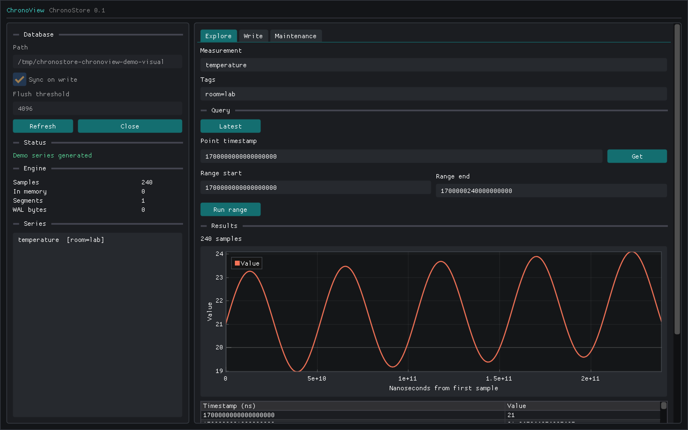
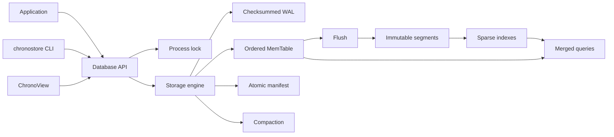

# ChronoStore

[](https://github.com/peprick/chronostore/actions/workflows/ci.yml)


ChronoStore is a small embedded time-series storage engine for C++20. It stores
nanosecond-resolution numeric samples under canonical measurement/tag keys and
provides durable writes, exact and range queries, immutable indexed segments,
crash recovery, compaction, a CLI, and a native inspector.

The engine is intentionally single-node and inspectable. Its WAL, manifest,
segment format, recovery rules, and concurrency model are implemented in this
repository rather than delegated to another database.

> **Pre-1.0:** ChronoStore 0.1.0 is usable for experimentation and integration,
> but source APIs and persistent formats may change before 1.0. Unknown on-disk
> versions are rejected rather than guessed.



## Highlights

- **Durable by default:** successful writes use a checksummed write-ahead log
  and sync-on-write durability unless configured otherwise.
- **Crash-aware publication:** segment and manifest updates use synchronized
  temporary files and atomic replacement.
- **Indexed immutable storage:** one sparse index entry per block allows point,
  latest, and bounded range reads without loading every segment block.
- **Deterministic recovery:** complete WAL records replay in order, interrupted
  final records are repaired, and complete corruption is rejected.
- **Defined overwrite semantics:** the newest value wins for a repeated
  `(series, timestamp)` across memory, recovery, segments, and compaction.
- **Thread-safe embedding:** readers may run concurrently; mutations and
  maintenance are serialized; one process owns a database directory.
- **Small public surface:** the C++ API exposes model, database, statistics, and
  version types without leaking internal or third-party dependencies.
- **Operational tooling:** CLI, ChronoView, benchmark driver, CMake package,
  sanitizers, and 112 automated tests are included.

ChronoStore fits telemetry, observability, IoT, robotics, simulation, energy,
scientific, and market-data-style workloads. It is not finance-specific.

## Quick Start

Requirements: CMake 3.24+, Ninja, Git, and a C++20 compiler.

```bash
git clone https://github.com/peprick/chronostore.git
cd chronostore

cmake --preset dev
cmake --build --preset dev --parallel
ctest --preset dev
```

The first development configuration fetches the pinned GoogleTest source.
See [Getting Started](docs/getting-started.md) for manual CMake options,
platform notes, installation, and troubleshooting.

## Two-Minute Demo

### CLI

```bash
DB=./demo-db

./build/dev/chronostore put "$DB" temperature 100 21.5 room=lab
./build/dev/chronostore put "$DB" temperature 200 22.75 room=lab

./build/dev/chronostore latest "$DB" temperature room=lab
# 200    22.75

./build/dev/chronostore range "$DB" temperature 0 1000 room=lab
# 100    21.5
# 200    22.75

./build/dev/chronostore stats "$DB"
```

Use `chronostore --help` for every command. Output is tab-separated for shell
pipelines; missing point/latest values return exit status `2`.

### ChronoView

```bash
cmake --preset gui
cmake --build --preset gui --parallel
./build/gui/chronoview ./demo-db --demo
```

ChronoView discovers series, writes samples, runs point/latest/range queries,
plots results, displays exact timestamps, reports engine counters, and exposes
sync, flush, and compaction. The GUI uses the same public API as an external
application and is not part of the durability boundary.

## Embed It

```cpp
#include <chronostore/database.hpp>

chronostore::Database database{"telemetry-db"};
const chronostore::SeriesKey series{
    "temperature", {chronostore::Tag{"room", "lab"}}};

database.put(
    series,
    chronostore::Sample{
        chronostore::Timestamp{1'700'000'000'000'000'000LL}, 21.5});

const auto latest = database.latest(series);
const auto samples = database.range(
    series,
    chronostore::Timestamp{1'699'999'999'000'000'000LL},
    chronostore::Timestamp{1'700'000'001'000'000'000LL});
```

The full contract is documented in the [C++ API Guide](docs/api.md).

## How It Works



### Write Path

1. Determine whether the logical sample already exists.
2. Encode and append a checksummed WAL record.
3. Synchronize the WAL in `sync_on_write` mode.
4. Insert or replace the sample in the ordered MemTable.
5. Flush at the configured sample threshold.

### Flush Commit Point

1. Snapshot and split the MemTable into blocks of at most 256 samples.
2. Write, synchronize, atomically publish, and reopen a new segment.
3. Atomically replace the manifest with the new live segment set.
4. Durably reset the WAL, then clear the MemTable.

A crash after manifest publication but before WAL reset is safe: recovery
recognizes already-published logical samples and does not double-count them.

### Read Path

Point and range queries search in-memory state and ordered segment indexes,
read only candidate blocks, validate block/index agreement, and merge sources
with newest-value-wins semantics. The current vector-returning range API
materializes its final result in memory.

Read the [Architecture](docs/architecture.md) and exact
[File Formats](docs/file-formats.md) for invariants and byte layouts.

## Guarantees At A Glance

| Area | 0.1 behavior |
|---|---|
| Series identity | Measurement plus key-sorted unique tags |
| Timestamp | Signed 64-bit Unix nanoseconds |
| Value | Finite IEEE 754 `double` |
| Duplicate timestamp | Last write wins; logical count stays unchanged |
| Range | Ordered, half-open `[start, end)` |
| Default durability | WAL synchronized before successful `put` returns |
| Corruption | CRC32C plus strict bounds, count, offset, and version checks |
| Readers | Concurrent under a shared engine lock |
| Writers | Serialized with flush and compaction |
| Processes | One owning process per database directory |
| Flush/compaction | Synchronous on the caller thread |

CRC32C protects against accidental corruption, not malicious modification by a
process with filesystem write access. See [Security Policy](SECURITY.md).

## Build Presets

| Preset | Output | Purpose |
|---|---|---|
| `dev` | `build/dev` | Debug library, CLI, examples, and tests |
| `release` | `build/release` | Optimized library and CLI |
| `sanitizers` | `build/sanitizers` | ASan/UBSan test build |
| `benchmark` | `build/benchmark` | Optimized benchmark driver |
| `gui` | `build/gui` | Optimized CLI and ChronoView |

```bash
cmake --preset sanitizers
cmake --build --preset sanitizers --parallel
ctest --preset sanitizers

cmake --preset benchmark
cmake --build --preset benchmark --parallel
./build/benchmark/chronostore-benchmark 100000
```

Benchmark results are workload- and machine-specific. The driver and reporting
rules are described in [Benchmarking](docs/benchmarks.md).

## Install And Consume

```bash
cmake --preset release
cmake --build --preset release --parallel
cmake --install build/release --prefix "$PWD/install"
```

```cmake
find_package(ChronoStore 0.1 CONFIG REQUIRED)
target_link_libraries(my_application PRIVATE ChronoStore::chronostore)
```

Configure the consuming project with
`-DCMAKE_PREFIX_PATH=/path/to/chronostore/install`.

## Documentation

| Document | Contents |
|---|---|
| [Getting Started](docs/getting-started.md) | Prerequisites, presets, CLI, GUI, install, troubleshooting |
| [C++ API Guide](docs/api.md) | Model, lifecycle, durability, queries, statistics, errors |
| [Architecture](docs/architecture.md) | Components, write/read paths, recovery, concurrency, compaction |
| [File Formats](docs/file-formats.md) | WAL, block, segment, index, manifest, atomic publication |
| [ChronoView](docs/chronoview.md) | Native GUI build, controls, and ownership |
| [Benchmarking](docs/benchmarks.md) | Workload, safety, methodology, reporting |
| [Roadmap](docs/roadmap.md) | Shipped scope, priorities, and non-goals |
| [Changelog](CHANGELOG.md) | Release history and compatibility notes |

## Current Boundaries

- Single machine and one owning process; no replication or network protocol.
- Numeric `double` samples only; no deletes, retention policies, or SQL.
- Uncompressed version-one blocks and no decoded-block cache yet.
- Whole-segment synchronous compaction that materializes selected samples.
- Vector-returning range API rather than a streaming cursor.
- No migration tool for pre-1.0 persistent formats.

These limits are explicit so future work can be measured against a correct,
understandable baseline. See the [Roadmap](docs/roadmap.md).

## Contributing

Contributions are welcome. Start with [CONTRIBUTING.md](CONTRIBUTING.md), use
the issue templates for bugs and proposals, and report vulnerabilities through
the private process in [SECURITY.md](SECURITY.md).

The CI matrix builds and tests Linux, macOS, and Windows; runs ASan/UBSan;
verifies installation from an external CMake consumer; and compiles
ChronoView on macOS.

## License

No open-source license has been selected yet. Until a `LICENSE` file is added,
the repository is source-available for evaluation but does not grant reuse or
redistribution rights. Dependency licenses are listed in
[Third-Party Notices](THIRD_PARTY_NOTICES.md).
