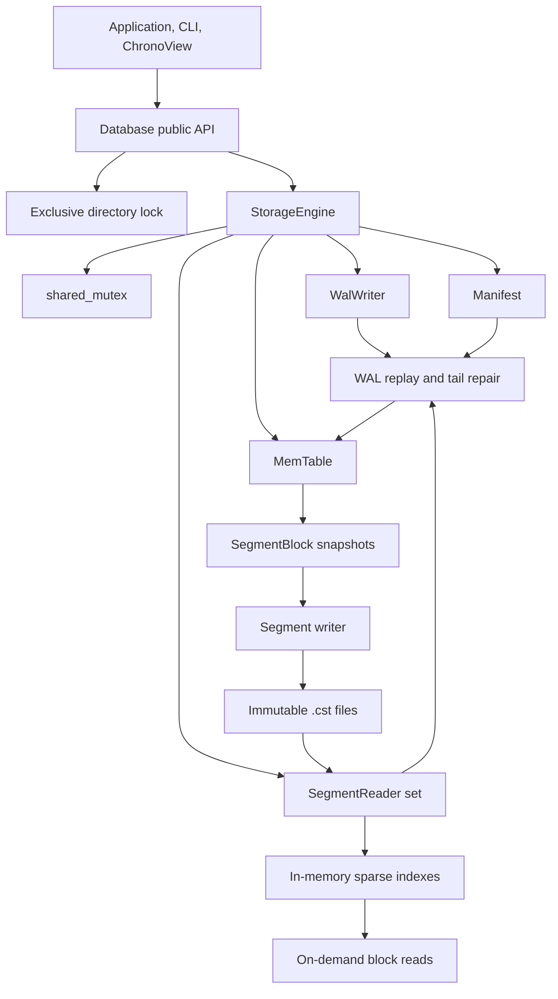

# ChronoStore Architecture

This document describes the implemented v0.1 architecture. It distinguishes
current guarantees from future work so that behavior can be reviewed against
the code and tests.

## Scope

ChronoStore is a single-node embedded engine for timestamped numeric samples.
It owns a database directory, runs inside the calling process, and supports:

- ordered writes with last-write-wins replacement;
- exact timestamp, latest, and half-open range queries;
- a durable write-ahead log;
- immutable indexed segments;
- atomic metadata publication;
- restart recovery and incomplete-tail repair;
- explicit flush and compaction operations;
- concurrent callers within one process.

SQL, joins, replication, authentication, delete semantics, and multi-tenant
resource isolation are outside v0.1.

## Component Map



The public `Database` class uses PImpl, so file-format and platform-I/O types do
not leak into consumer headers. ChronoView and the CLI use only this public API.

## Data Model

`SeriesKey` contains a non-empty measurement and zero or more `Tag` values.
Construction sorts tags and rejects duplicate keys. This gives one canonical
ordering for comparisons, maps, WAL records, and segment indexes.

`Timestamp` is a signed 64-bit count of nanoseconds since the Unix epoch.
`Sample` pairs a timestamp with a finite IEEE 754 `double`; NaN and infinity
are rejected.

For one series, timestamps are unique. A later write to an existing timestamp
replaces its value. The logical sample count therefore counts unique
`(series, timestamp)` pairs, not physical copies across segments.

## Public API Boundary

The public API provides:

- `put`, `get`, `latest`, and `range`;
- sorted series discovery;
- `sync`, `flush`, and `compact`;
- exact logical, in-memory, segment, and WAL statistics;
- buffered and sync-on-write durability modes.

Malformed persistent state is translated to `DatabaseCorruptionError`.
Concurrent process ownership is reported as `DatabaseBusyError`. Model errors
use standard argument exceptions and I/O failures retain `std::system_error`.

`Database` is move-only. Calling an operation on a moved-from instance throws
`std::logic_error` rather than dereferencing an empty implementation pointer.

## Write Path

A `put` takes the engine's exclusive lock and executes this order:

1. Determine whether the `(series, timestamp)` already exists in memory or a
   segment.
2. Encode and append a checksummed WAL record.
3. Synchronize the WAL when durability is `sync_on_write`.
4. Insert or replace the sample in the ordered MemTable.
5. Increment the logical count only for a new timestamp.

The WAL-before-memory order guarantees that every successfully acknowledged
sync-on-write mutation can be reconstructed after restart. If an I/O or
mutation step fails, the engine enters a failed state and requires reopening;
it does not continue after an uncertain partial operation.

The public layer checks the configured MemTable threshold after a write. If it
is reached, `flush` runs synchronously on that caller.

## MemTable

The MemTable is a reference-friendly ordered structure:

```text
map<SeriesKey, map<Timestamp, double>>
```

It favors explicit semantics over specialized allocation. Point insertion and
lookup are logarithmic; a range lookup seeks with `lower_bound` and walks only
the selected interval. Snapshots are emitted in canonical series and timestamp
order for segment construction.

## Flush And Segment Publication

`flush` holds the exclusive engine lock and performs:

1. Snapshot the MemTable in sorted order.
2. Split each series into blocks of at most 256 samples.
3. Encode a new immutable segment into a temporary file.
4. Synchronize the file, atomically rename it, and synchronize the parent
   directory where supported.
5. Open the segment through `SegmentReader` to validate its envelope and index.
6. Write and atomically replace a manifest containing the new live segment set
   and logical count.
7. Install the new reader in memory.
8. Durably truncate the WAL.
9. Clear the MemTable.

The segment becomes database state only at manifest publication. An orphan
segment left by a crash before that point is removed during startup.

## Segment Layout And Sparse Index

Each segment contains a fixed header, one or more checksummed blocks, a
checksummed sparse index, and a fixed footer. Header and footer independently
record block count and index bounds; they must agree.

The index has one entry per block:

- canonical series key;
- first and last timestamp;
- file offset and encoded byte length;
- sample count.

Opening a segment reads the header, footer, and index, not every data block.
Point, latest, and range operations search the ordered index and fetch only
candidate blocks. A fetched block must match all metadata in its index entry.

Detailed byte layouts are in [File Formats](file-formats.md).

## Read Path

Queries take a shared engine lock, preventing a flush or write from changing
the visible source set while the query runs.

- `get` checks the MemTable first, then segments from newest to oldest.
- `latest` asks each segment and the MemTable for a candidate and keeps the
  greatest timestamp, with newer memory state winning ties.
- `range` reads overlapping blocks from segments in manifest order, then
  overlays MemTable values in an ordered timestamp map.
- `series` unions MemTable keys with series keys from all segment indexes.

The latest physical value wins when duplicate timestamps exist across
segments. Returned ranges are ordered and half-open `[start, end)`.

Segment I/O is bounded to matching blocks, but the public range result and its
merge map are materialized in memory. A streaming cursor is future work.

## Manifest

The manifest is the commit point for the persistent segment set. It stores:

- format version and flags;
- monotonically increasing generation;
- logical sample count represented by the live segments;
- ordered live segment filenames;
- payload length and its bitwise inverse;
- CRC32C over all preceding bytes.

Updates use write-temporary, synchronize, atomic rename, and directory
synchronization. Startup never guesses live state by scanning segment names.
Only the checksummed manifest decides which segments are part of the database.

## Recovery

Database startup holds the process lock throughout recovery:

1. Load and validate the manifest, or use an empty state when it does not yet
   exist.
2. Open every referenced segment and validate its envelope and index.
3. Remove unreferenced segment files and stale segment temporary files.
4. Verify that the manifest logical count is possible for its physical
   segments.
5. Stream WAL records in order and replay each complete checksummed record.
6. Treat an incomplete final record as an interrupted append and truncate it.
7. Reject corruption in any complete record with an exact byte offset.
8. Open the WAL writer only after the recovered size is known and stable.

There is a deliberate crash window after manifest publication and before WAL
reset. Recovery checks both the recovered MemTable and live segments before
incrementing the logical count, so replaying those duplicate WAL records is
idempotent.

## Compaction

The v0.1 compactor runs synchronously and merges all current segments:

1. Decode blocks in oldest-to-newest segment order.
2. Overlay values in ordered per-series timestamp maps.
3. Verify the compacted unique count against the manifest.
4. Write and validate one replacement segment.
5. Atomically publish a manifest referencing only the replacement.
6. Swap the in-memory reader set.
7. Remove obsolete files on a best-effort basis.

If the process stops before manifest publication, startup removes the orphan
replacement. If it stops after publication, the new manifest is authoritative
and old unreferenced segments are removed at startup.

Compaction currently loads all selected samples in memory. Selection policies,
levels, background workers, and reader-epoch reclamation are future work.

## Concurrency Model

- An OS file lock permits exactly one owning process per database directory.
- A `std::shared_mutex` protects all engine state.
- Point, latest, range, series, count, and stats operations use shared locks.
- Put, sync, flush, and compact operations use exclusive locks.
- Immutable segment files require no mutation synchronization after
  publication.
- Public methods are safe for concurrent calls on the same `Database` object.

This model is intentionally simple and testable. It provides concurrent reads
and a total mutation order, but long range queries delay writers because the
shared lock is held through result construction.

## Durability Modes

`sync_on_write` uses `_commit` on Windows, `F_FULLFSYNC` with an `fsync`
fallback on macOS, and `fsync` on other POSIX systems. It is the default.

`buffered` writes complete records to the operating system without syncing
each append. Callers must use `sync` or `flush` before making a durable-write
claim. Segment and manifest publication always synchronize regardless of the
WAL mode.

## Format Defense

Persistent decoders validate bounds before allocation or slicing. Formats use
explicit fixed-width little-endian fields and never persist `sizeof`-dependent
object layouts, pointers, padding, or `std::hash` values. Length fields are
paired with their bitwise inverse where an early framing check matters.

CRC32C detects accidental corruption. It is not authentication and does not
protect against a malicious writer with filesystem access.

## Tooling Layers

The CLI, benchmark, example, and ChronoView all link the public CMake target
`ChronoStore::chronostore`. The native GUI is optional because it adds GLFW,
Dear ImGui, ImPlot, and OpenGL dependencies; the core library has no GUI or
network dependency.

## Current Tradeoffs

- Blocks are uncompressed to keep the first format inspectable and measurable.
- There is no decoded-block cache.
- Flush and compaction are synchronous.
- Compaction is whole-database rather than leveled.
- The public range API materializes results.
- There are no deletes, tombstones, retention policies, or transactions across
  multiple samples.
- One process owns the directory; inter-process read sharing is not supported.
- Pre-1.0 file formats have no migration tool.

These are explicit v0.1 boundaries, not hidden claims. They identify the next
systems work without weakening the implemented durability path.
